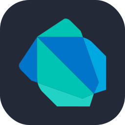

# Hello, I'm Abdelrhman  👋

**I'm a student passionate about technology, currently exploring the realms of Front-End Development with Angular and Embedded Systems. I'm also venturing into Backend Development using Django and learning to build RESTful APIs.**

(My Portfolio will be available soon)

  
  
  
    </a>
  

  

  

  
  
  <a href="https://github.com/zainmo11">
    

    

## 🌱 Learning

- 🅰️ **Front-End Development:** Angular, HTML, CSS, Tailwind, JavaScript, TypeScript
- 🤖 **Embedded Development:** C, Embedded, ARM, RTOS
- 🌐 **Backend Development:** Python, Django, RESTful APIs
- 📚 **Current Courses:** React Js

  

<h4 align="center"> 
 Languages | Tools 
 </h4>
  

   
   
  
   
   
  

  
  
     
     
   
  

   
  
    
     
   
   

   
     
   

 

## 🚀 Goals

- **Gain deeper insights into Front-End technologies**
- **Excel in Embedded Systems development**
- **Build full-stack applications with Django and Angular**

## 📚 Currently Studying

- **Computer and Systems Engineering at Ain Shams University.**

## 📫 Let's Connect

- **LinkedIn: [Abdelrhman zain](https://www.linkedin.com/in/abdelrhman-zain-34a350203/)**
- **Gmail: [zyn6681@gmail.com](zyn6681@gmail.com)**

## 🌐 Explore More

- **[Comming Soon !](!)**

## 🌟 Fun Fact

- **I love playing chess ♟️.**
- **I'm fascinated by space science and often delve into astrophysics readings 🚀.**
# 
Thanks for stopping by! 🚀

